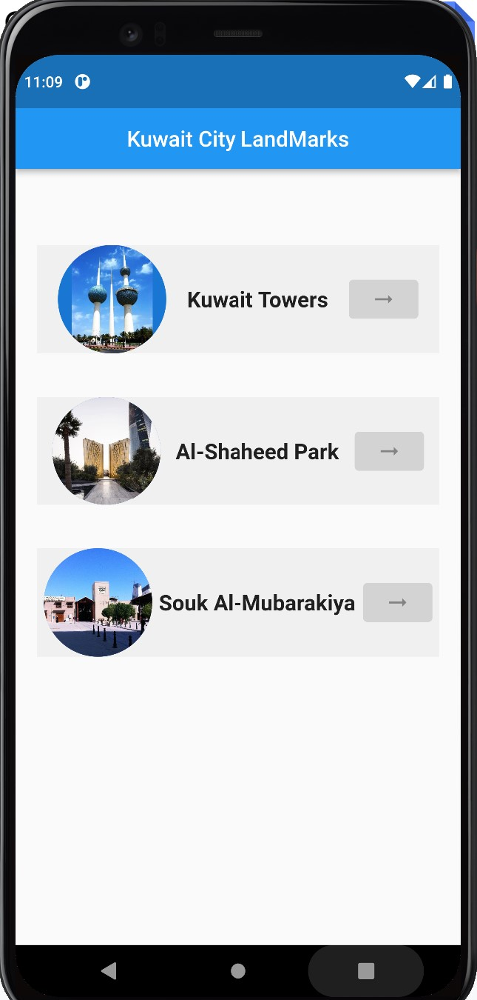

# UC-Flutter-cw-6

## تمرين

في هذا التمرين المطلوب هو صنع برنامج يحتوي على ListView تعرض من خلالها قائمة معالم الكويت التالية : kuwait towers , Liberation Tower , Grand Mosque وفي نهاية التمرين يجب أن تكون النتيجة مقاربة للشكل التالي:

1. قم بعمل fork للـ repository
2. افتح الـ repository باستخدام github desktop
3. ادخل على برنامج VS code وانشاء ملف تمرين داخل مجلد cw-1 في ال repository
4. قم بإنشاء برنامج Flutter جديد و احفظه داخل الملف
5. أضف MatiralApp و Scofield للبرنامج
6. ننشأ class building والذي يحتوي على المعلومات المهمة للمبنى

```dart
class Building {
  String name;
  String imgUrl;

  Building({required this.name, required this.imgUrl});
}
```

7. ننشأ list و فيها معالم الكويت

```dart
var buildings = [
  Building(
    name: 'أبراج الكويت',
    imgUrl:
        'https://user-images.githubusercontent.com/24327781/188260105-52be6a2e-a6d3-4ceb-86c0-ddc83e0aa5b6.jpeg',
  ),
  Building(
    name: 'برج التحرير',
    imgUrl:
        'https://user-images.githubusercontent.com/24327781/188260123-28de85b4-d272-4ebb-b2ad-22a9582079bf.jpeg',
  ),
  Building(
    name: 'المسجد الكبير',
    imgUrl:
        'https://user-images.githubusercontent.com/24327781/188260137-021d865a-625e-4941-ad75-6427c690e0cf.jpeg',
  ),
];
```

8. نضيف ListView للبرنامج و في داخلها نعرض معالم الكويت و صور المباني كما هو موضح بالصوره
9. قم بإنشاء صفحة اخرى تستعرض أسم المعلم وصورة المبنى بشكل أكبر



### بونص

قم بإضافة متغير description داخل building class وقم بإضافة الوصف لكل مبنى وأستعرضه الوصف أسفل الصورة في الصفحة الثانية
