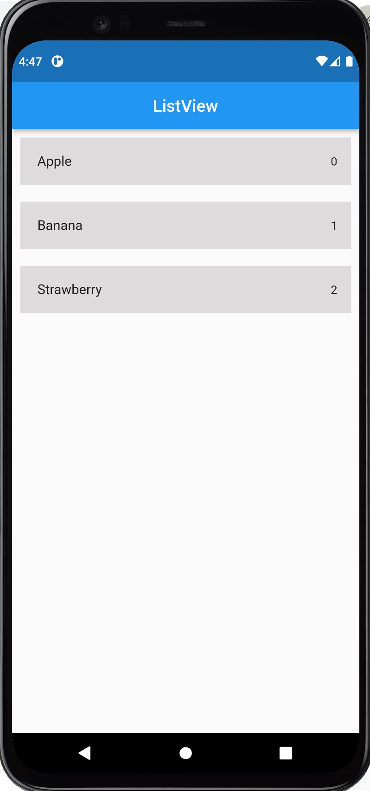

# UC-Flutter-cw-6

## تمرين 
في هذا التمرين المطلوب هو صنع برنامج يحتوي على ListView تعرض من خلالها قائمة الأطعمة التالية : Apple , banana , strawberry  وفي نهاية التمرين يجب أن تكون النتيجة مقاربة للشكل التالي:
1. قم بعمل fork للـ repository
2. افتح الـ repository باستخدام github desktop
3. ادخل على برنامج VS code   وانشاء ملف تمرين داخل مجلد cw-1 في ال repository
4. قم بإنشاء برنامج Flutter جديد و احفظه داخل الملف
5. أضف MatiralApp  و Scofield للبرنامج
6. ننشأ list و فيها اطعمتكم المفضلة
7. نضيف ListView للبرنامج و في داخلها  نعرض الاطمعة و ترقيمها كما هو موضح بالصوره

